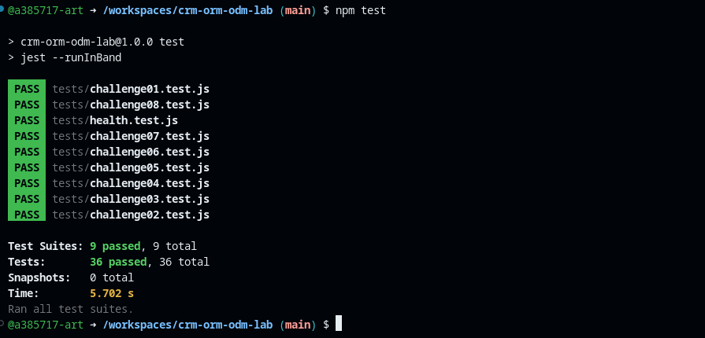

# CRM ORM/ODM Lab

API REST de un CRM básico que combina un ORM (Sequelize + PostgreSQL) y un ODM (Mongoose + MongoDB).

## Stack

- Node.js 22, Express 5, CommonJS
- Sequelize + PostgreSQL 16 (`User`, `Company`, `Contact`)
- Mongoose + MongoDB 7 (`Activity`)
- Jest + Supertest
- GitHub Codespaces, Dev Containers, Docker Compose
- Supervisor (`npm run dev`)

## Arquitectura

```text
GitHub Codespace
│
├── app       Node.js 22  ──┬── Sequelize ──> postgres (PostgreSQL)
│                           └── Mongoose  ──> mongo    (MongoDB)
├── postgres
└── mongo
```

La aplicación se conecta por nombre de servicio (`postgres`, `mongo`). Las credenciales de desarrollo llegan como variables de entorno definidas en `.devcontainer/docker-compose.yml` (ver `.env.example`).

## Iniciar el Codespace

1. En GitHub: **Code → Codespaces → Create codespace on main**.
2. Espera a que se levanten los tres servicios (`app`, `postgres`, `mongo`). `postCreateCommand` ejecuta `npm install`.

## Instalar dependencias

```bash
npm install
```

## Seed y reset

```bash
npm run seed    # inserta datos deterministas (3 users, 4 companies, 8 contacts, 10 activities)
npm run reset   # elimina y recrea tablas/base de datos y vuelve a sembrar
```

## Iniciar la API

```bash
npm start       # node ./bin/www
npm run dev     # supervisor ./bin/www
```

Servidor en el puerto `3000` (variable `PORT`).

## Pruebas

```bash
npm test
```

Cada suite restablece PostgreSQL y MongoDB antes de ejecutarse y cierra las conexiones al terminar.

## Endpoints

| Método | Ruta | Descripción |
|---|---|---|
| GET | `/health` | Health check |
| GET | `/users` | Listar usuarios |
| GET | `/users/:id` | Obtener usuario |
| POST | `/users` | Crear usuario |
| PUT | `/users/:id` | Actualizar usuario |
| DELETE | `/users/:id` | Eliminar usuario |
| GET | `/companies` | Listar compañías (`?industry=`) |
| GET | `/companies/:id` | Obtener compañía |
| POST | `/companies` | Crear compañía |
| PUT | `/companies/:id` | Actualizar compañía |
| DELETE | `/companies/:id` | Eliminar compañía |
| GET | `/contacts` | Listar contactos |
| GET | `/contacts/:id` | Obtener contacto |
| POST | `/contacts` | Crear contacto |
| PUT | `/contacts/:id` | Actualizar contacto |
| DELETE | `/contacts/:id` | Eliminar contacto |
| GET | `/activities` | Listar actividades (`?type=`) |
| GET | `/activities/:id` | Obtener actividad |
| POST | `/activities` | Crear actividad |
| PUT | `/activities/:id` | Actualizar actividad |
| DELETE | `/activities/:id` | Eliminar actividad |

Los errores se devuelven como JSON: `{ "error": "Contact not found" }`.

## Respuestas

### Sobre la arquitectura

**1. Dos motores.**

*Pregunta:* En este proyecto `User`, `Company` y `Contact` viven en PostgreSQL y `Activity` en MongoDB. Da una razón por la que `Activity` es buen candidato para una base documental y otra por la que `Company` y `Contact` son buenos candidatos para una base relacional.

*Respuesta:* `Activity` es buen candidato para una base de documentos porque puede haber muchas actividades de diferentes tipos que pueden o no tener los mismos atributos, y una base documental da esa flexibilidad. `Company` y `Contact` son buenos candidatos para una base relacional porque permiten modelar sus relaciones (como la de uno a muchos) con llaves foráneas que garantizan la integridad de los datos.

**2. ORM vs. ODM.**

*Pregunta:* ¿Qué es un ORM y qué es un ODM? Nombra la librería de cada uno en este proyecto y una diferencia importante entre ambos.

*Respuesta:* Un ORM es una herramienta que permite conectar el código de una aplicación orientada a objetos con una base de datos relacional como MySQL o PostgreSQL. Un ODM es lo mismo, pero para una base de datos de documentos como MongoDB. En este proyecto el ORM es Sequelize y el ODM es Mongoose. La diferencia importante es que el ORM mapea clases y objetos a tablas, filas y columnas, mientras que el ODM los mapea a documentos independientes.

**3. Configuración por variables de entorno.**

*Pregunta:* Las credenciales de las bases de datos no están escritas en el código JavaScript. ¿Dónde se definen en este Codespace y por qué es mala práctica escribirlas dentro de los archivos `.js`? Menciona los nombres de host que usa la app para conectarse (`DB_HOST` y `MONGODB_URI`) y por qué no son `localhost`.

*Respuesta:* Se definen como variables de entorno en `.devcontainer/docker-compose.yml`, en el servicio `app`, y `.env.example` muestra los nombres. Escribirlas en los `.js` es mala práctica porque quedarían en el repositorio y expuestas en GitHub, y habría que editar código para cambiarlas entre entornos. `DB_HOST` apunta al host `postgres` y `MONGODB_URI` usa el host `mongo`, que son nombres de servicio de Docker Compose. No son `localhost` porque dentro del contenedor `app`, `localhost` es el propio contenedor `app`, donde no corre ninguna base de datos.

### Sobre Sequelize y PostgreSQL

**4. Asociaciones.**

*Pregunta:* Explica qué relación existe entre `Company` y `Contact` según `models/sequelize/index.js`. ¿Cuál es la llave foránea, en qué tabla vive y para qué sirve el alias `as: 'contacts'`?

*Respuesta:* La relación es de uno a muchos: una compañía tiene muchos contactos (`Company.hasMany(Contact)` y `Contact.belongsTo(Company)`). La llave foránea es `companyId` y vive en la tabla de contactos, que es el lado de "muchos". El alias `as: 'contacts'` es el nombre con el que aparecen los contactos dentro de la compañía al hacer `include` (el arreglo `contacts`), y se debe usar igual en `include: { model: Contact, as: 'contacts' }`.

**5. Eager loading.**

*Pregunta:* En el Reto 05, ¿qué diferencia habría entre traer la compañía y luego hacer una segunda consulta para sus contactos, y traerlos en la misma consulta con `include`? ¿Cuál es preferible y por qué?

*Respuesta:* Con dos consultas primero se trae la compañía y luego otra consulta para sus contactos: son dos viajes a la base de datos y hay que juntar los resultados a mano. Con `include`, Sequelize hace una sola consulta con un `LEFT JOIN` y regresa la compañía con su arreglo `contacts` ya armado (vacío si no tiene contactos). Es preferible `include` porque usa menos consultas y menos código, y evita el problema de las consultas repetidas (N+1) cuando se piden muchas compañías a la vez.

**6. Instancia vs. consulta.**

*Pregunta:* En `update` de contactos primero se busca el registro y luego se modifica. Compara ese enfoque con hacer un `Model.update({...}, { where })` directo: ¿qué ventaja tiene cada uno? (Pista: ¿qué devuelve cada uno?)

*Respuesta:* Buscar primero el registro con `findByPk` y luego usar `contact.update(...)` permite responder 404 si no existe y deja la instancia ya actualizada para regresarla con `res.json(contact)`, aunque cuesta dos consultas. `Model.update({...}, { where })` es una sola consulta y sirve para actualizar muchos registros a la vez, pero devuelve solo el número de filas afectadas, no el registro actualizado, así que habría que consultarlo otra vez.

### Sobre Mongoose y MongoDB

**7. Esquema flexible.**

*Pregunta:* ¿Qué tipo de dato se usa para `metadata` en `models/mongoose/activity.js` y por qué permite guardar estructuras distintas para `CALL`, `EMAIL` y `MEETING`? ¿Qué desventaja tiene frente a definir cada campo con su tipo?

*Respuesta:* `metadata` usa un tipo flexible (`Mixed`) que acepta cualquier objeto sin una estructura fija. Por eso una llamada puede guardar `duration` y `result`, un correo `subject` y `opened`, y una reunión `location` y `attendees`. La desventaja es que Mongoose no valida ni tipa lo que hay adentro, así que se pueden guardar campos mal escritos o con el tipo equivocado, y es más difícil garantizar y consultar una estructura consistente.

**8. Sin ref.**

*Pregunta:* `contactId` y `userId` en `Activity` son números y no usan `ref`. ¿Por qué no se puede usar `ref`/`populate` aquí? ¿Qué consecuencia tiene para la integridad de los datos (por ejemplo, si se elimina un `User` en PostgreSQL)?

*Respuesta:* `ref` y `populate` solo funcionan entre colecciones de MongoDB, porque `ref` apunta a otro modelo de Mongoose por su `ObjectId`. `contactId` y `userId` son ids numéricos de tablas de PostgreSQL, que Mongoose no conoce, así que no hay un modelo que poblar. La consecuencia es que ninguna de las dos bases revisa la integridad entre ellas: si se elimina un `User` en PostgreSQL, sus actividades siguen en MongoDB con un `userId` que ya no existe (registros huérfanos), y esa limpieza tendría que hacerse desde el código.

**9. Documento actualizado.**

*Pregunta:* En el Reto 08, ¿qué devolvía la actualización antes de tu corrección y por qué? ¿Qué cambiaste para que devolviera el documento actualizado?

*Respuesta:* Antes, `update` en `controllers/activities.js` usaba `Activity.findByIdAndUpdate(req.params.id, req.body)` sin opciones. Por defecto Mongoose devuelve el documento como estaba antes del cambio, así que la respuesta traía los datos viejos aunque la base sí se había actualizado. Agregué `{ new: true, runValidators: true }`: `new: true` hace que regrese el documento ya actualizado y `runValidators: true` aplica las validaciones del esquema durante la actualización.

### Sobre pruebas y proceso

**10. Pruebas de comportamiento.**

*Pregunta:* Las pruebas no verifican que uses `findAll()` ni `find()`, sino la respuesta de la API. ¿Qué ventaja tiene probar el comportamiento en lugar de la implementación?

*Respuesta:* Probar el comportamiento verifica lo que realmente recibe quien usa la API, sin atar las pruebas a una forma de escribir el código. Así cualquier solución correcta pasa, y se puede cambiar o refactorizar la implementación (por ejemplo, usar otro método del ORM) sin romper las pruebas. Las pruebas de implementación fallarían por cambios que no afectan el resultado.

**11. Repetibilidad.**

*Pregunta:* ¿Qué hace `tests/setup.js` antes y después de cada suite y por qué es necesario para que `npm test` dé el mismo resultado cada vez que se ejecuta?

*Respuesta:* Antes de cada suite (`beforeAll`), `tests/setup.js` se conecta a PostgreSQL y a MongoDB y llama a `reset()` de `seeders/seed.js`: vacía las tablas de PostgreSQL con `truncate` (con `restartIdentity`, para que los ids vuelvan a empezar en 1), vuelve a insertar los datos iniciales y hace lo mismo en MongoDB. Después de la suite (`afterAll`) cierra ambas conexiones para que Jest no se quede abierto. Es necesario porque las pruebas esperan datos exactos (por ejemplo 8 contactos y 10 actividades) y otras suites crean, editan o borran registros; sin el reset el resultado dependería del orden y de ejecuciones anteriores. Además `npm test` usa `jest --runInBand`, así las suites corren una por una y no se pisan al compartir las mismas bases.

**12. Tu experiencia.**

*Pregunta:* ¿Cuál fue el reto más difícil y qué hiciste para resolverlo? Describe un error o mensaje de fallo de Jest que te ayudó a encontrar el problema.

*Respuesta:* El reto más difícil fue el 07 (`update` de contactos), no por ser complejo sino por un error de dedo: en la lista `fields` escribí `'firsName'` en lugar de `'firstName'`. Sequelize ignora en silencio un campo que no existe, así que no marcó ningún error. Lo que me ayudó fue el diff de Jest: la prueba esperaba `firstName: "Laura Elena"` pero recibió `"Laura"`, mientras que `phone` sí se había actualizado, lo que mostraba que solo ese campo se estaba ignorando. Al corregir el nombre del campo la prueba pasó.

## Evidencia

